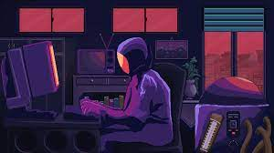

Hi , I'm Nethmini Jayamani ! ❤⭐

  

I’m a passionate undergraduate from NSBM Green University with experience in mobile app development and competitive Karate. I love creating modern, user-friendly apps and representing Sri Lanka in national-level sports.

  

🛠 Tech Stack

Languages: Dart, Java, HTML, CSS, JavaScript, PHP

Frameworks: Flutter

Database & Backend: Firebase (Authentication, Firestore, Realtime DB), MySQL

Tools: Git, GitHub, Figma, Canva, Adobe XD, Android Studio, XAMPP

Other Skills: UI/UX Design, QR Code Scanning Integration, Responsive Web Design

🏆 Achievements

• Best Player – NSBM Sports Fiesta 2025 🥋🎖

• National Level Karate Player 🥋🎖

• NSBM Karate Club – Girls' Captain 🥋

Volunteer & Designer – NSBM Clubs

📱 Projects

• GoWay App
A mobile app for scanning QR codes to manage event participation, built with Flutter & Firebase.
🔧 Dart, Firebase Auth, Firestore, Realtime DB

• Garage Management System
A complete vehicle garage service management platform with customer, mechanic, and service tracking modules.
🔧 PHP, MySQL, HTML, CSS, Bootstrap

• EduTrack
An educational progress tracker designed for students to log academic performance and class activities.
🔧 Flutter, Firebase

• Aura Serene (UI/UX Focused Project)
A mental wellness mobile app concept that provides relaxation techniques and mood tracking.
🔧 Figma, Flutter (prototype level)
 
• Cinema Website
A responsive web application for booking movie tickets and managing cinema schedules.
🔧 HTML, CSS, JavaScript, PHP, MySQL

• EventManager (Upcoming)
App for university event registration and real-time updates.
🔧 Flutter, Firebase

• KarateTracker (Upcoming)
An athlete performance tracking app designed for martial artists.
🔧 Flutter, Firebase

📚 Research

Co-Author: "Enhancing Security with Biometric and Heart Rate Data Integration"
Published at ICACT – NSBM Green University 2024 Conference.
Conducted research on biometric authentication and cybersecurity under expert guidance.

✨ Highlights

Over 10 years of Karate experience – 3rd Dan Black Belt

Designed UI/UX for multiple NSBM club initiatives

Strong leadership, teamwork, and public speaking skills

📫 Let's Connect!

LinkedIn: Nethmini Navodya (https://www.linkedin.com/in/nethmini-navodya)

Email: [nethunavo24@gmail.com]

GitHub: github.com/NethuNavo (https://github.com/NethuNavo)

Discipline, consistency, and creativity are my cornerstones – whether in code or on the mat. ❤⭐  
